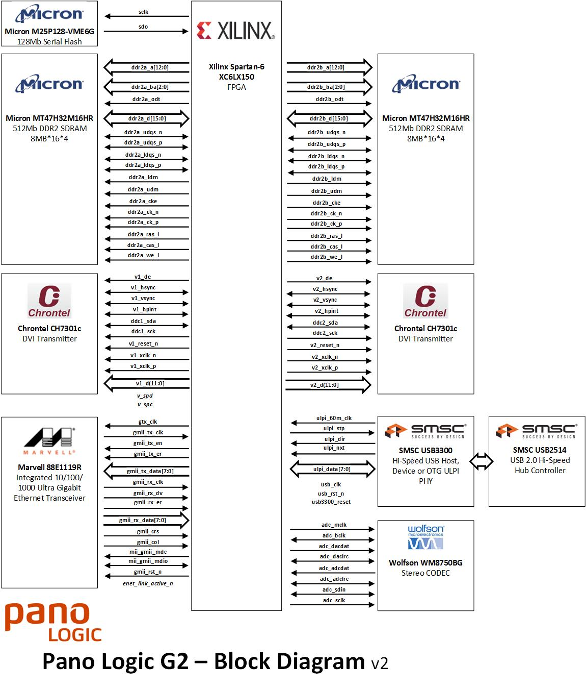

# Introduction

The Pano Logic device was originally a designed as a replacement for a full fat PC based end user device, a class of device known as *Thin Client*. An article in Hackaday in 2013 (http://hackaday.com/2013/01/11/ask-hackaday-we-might-have-some-fpgas-to-hack/) revealed that these devices basically just consist of a large Xilinx FPGA, plus some peripheral devices (USB, Ethernet, etc). This means they are largely /soft/, feature rich, and eminently hackable and re-purposable.

There are two main Pano Logic devices - the G1, based on a Xilinx Spartan 3 FPGA, and the G2, which uses a Spartan 6. I have concentrated my reverse engineering efforts on the G2, for two main reasons - 1) the S3 is rather long in the tooth now, and 2) the physical construction of the G2 means it is much more hacker friendly (more on this later).

## G2 Specification

* 2 * DVI connections (1 standard connector, one via a micro USB - DVI adapter)
* 1 * 100Mbs/1Gbs RJ45 Ethernet
* 4 * USB
* 1 * 3.5mm Audio jack
* Xilinx Spartan-6 xc6lx150-2c FPGA
* 2 * Chrontel CH7301C-TF DVI Transmitter
* Microchip SMSC USB2514hzh USB PHY
* Microchip SMSC USB3300-ezk USB Hub Controller
* Cirrus Logic WM8750bg Stereo CODEC
* Marvell 88e1119r-nnw2 Ethernet PHY
* 2 * Micron MT47H32M16HR-25E 8M*16*4 512Mb DDR2 SDRAM 
* 3 LEDs (R, G and B)
* 1 Micro switch
* 1 JTAG port (1.2mm pitch)
* Numerous voltage regulators (1.2V, 1.8V, 3.3V & 5V)

## Block Diagram

