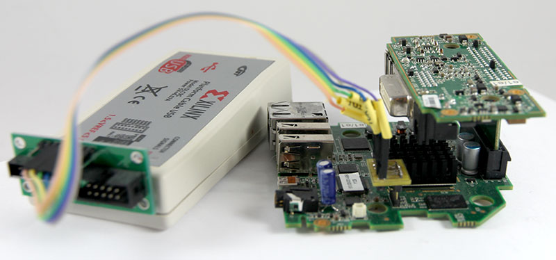
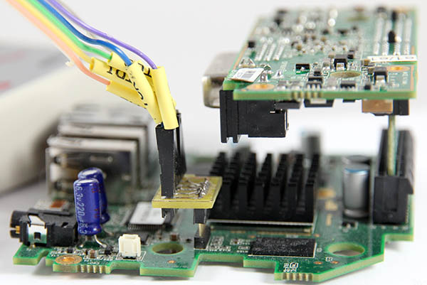
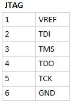
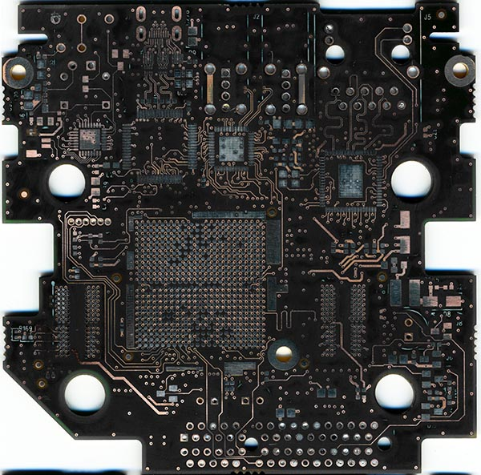
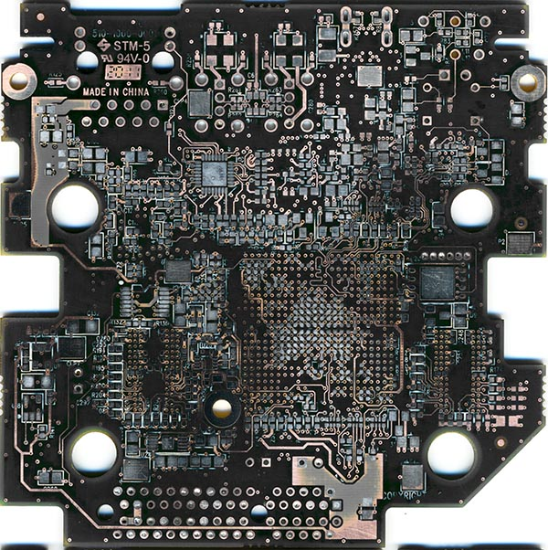
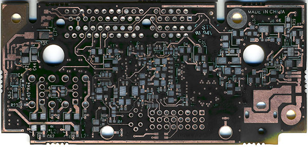

# Reverse Engineering

Connecting an eBay clone Xilinx Platform Cable USB connector to the JTAG with a simple adapter I made for the 1.2mm pitch connector showed that the device was straightforward to program. 

Using the *Universal Scan* boundary scan software (http://www.ricreations.com/boundary-scan-products.html - free 14 day trial!), with judicious use of shorting to gnd or 3.3V provided a very straightforward (if tedious) way to determine FPGA connectivity. Fortunately most, if not all, FPGA connections were accessible using VIAs.

< screen print tba >

Sadly, once this was completed, I discovered @cyrozap - he had completed the same task in parallel with me, and produced a .ucf file. I've compared this with my empirically derived data, and there is almost a complete match.

A set of bare boards was created by stripping off the components, and careful sanding. This was done to assist the process of reverse engineering the discreet component connectivity. The photos are still a work in progress, but here they are (hi-res versions in the images folder):

Main FPGA board - Top view

Main FPGA board - Bottom view

Secondary board (mainly power and connectivity) - Top view

Secondary board (mainly power and connectivity) - Bottom view.

The removed parts
